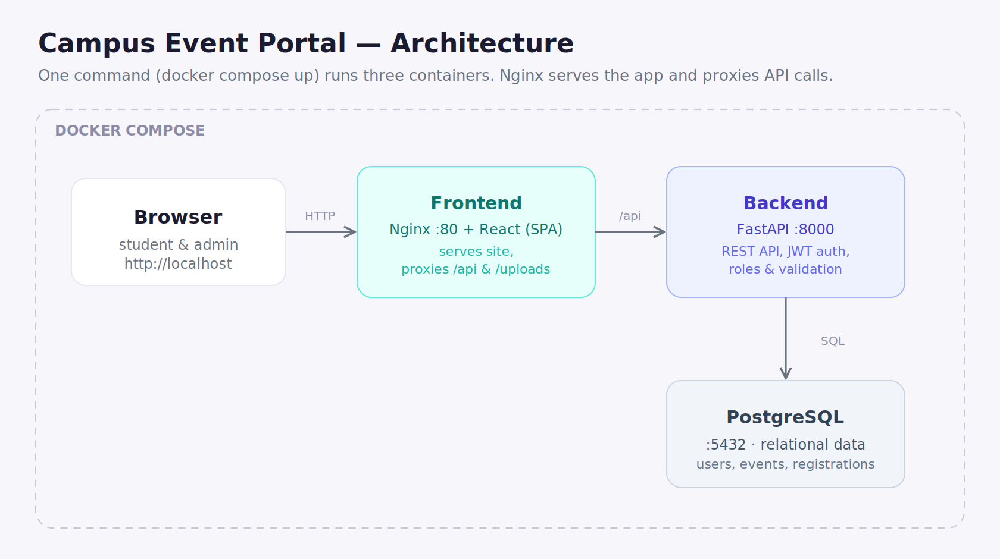

# Campus Event Portal

A Campus Event Management Portal where students discover and register for events
and admins manage events, participants, and announcements.

## Architecture



The whole app runs as three containers. The frontend's Nginx serves the React
site and reverse-proxies `/api` and `/uploads` to the backend, so the browser
only ever talks to one origin (no CORS in production).

## Tech stack

- **Frontend:** React (Vite), served by Nginx
- **Backend:** FastAPI (Python) + SQLAlchemy
- **Database:** PostgreSQL
- **Auth:** JWT (roles: `student`, `admin`)
- **Deployment:** Docker Compose

## To Run

Only need **Docker Desktop** installed and running.

```bash
docker compose up --build
```

Then open:

- **App:** http://localhost
- **API docs (Swagger):** http://localhost:8000/api/docs

An admin account is created automatically on first start:

- **Email:** `admin@campus.edu`
- **Password:** `admin123`

Students create their own accounts from the sign-up page.

## Features

**Student:** register/login, browse events, search, paginate, view details,
register/cancel, see "my events", edit profile, read announcements.

**Admin:** everything above plus create/edit/delete events, upload event banners,
view participants, manage announcements, and a dashboard with live counts.

## API overview

| Area          | Endpoints                                                                                                       |
| ------------- | --------------------------------------------------------------------------------------------------------------- |
| Auth          | `POST /api/auth/register`, `POST /api/auth/login`, `GET /api/auth/me`                                           |
| Events        | `GET /api/events` (search + pagination), `GET/POST/PUT/DELETE /api/events/{id}`, `POST /api/events/{id}/banner` |
| Registrations | `POST/DELETE /api/events/{id}/registrations`, `GET /api/events/{id}/registrations`, `GET /api/me/registrations` |
| Users         | `GET/PATCH /api/users/me`, `GET /api/users` (admin)                                                             |
| Announcements | `GET /api/announcements`, `POST/PUT/DELETE /api/announcements/{id}`                                             |
| Dashboard     | `GET /api/admin/stats`                                                                                          |

Full interactive docs are auto-generated at `/api/docs`.

## Run the tests

Backend tests run against a throwaway SQLite database (no Docker needed):

```bash
cd backend
pip install -r requirements.txt -r requirements-dev.txt
pytest
```

## Configuration (environment variables)

Set in `docker-compose.yml` (or a `.env` file — see `backend/.env.example`):

| Variable                                        | Purpose                                                 |
| ----------------------------------------------- | ------------------------------------------------------- |
| `DATABASE_URL`                                  | PostgreSQL connection string                            |
| `JWT_SECRET`                                    | Secret used to sign login tokens (change in production) |
| `ACCESS_TOKEN_EXPIRE_MINUTES`                   | How long a login lasts                                  |
| `ADMIN_EMAIL` / `ADMIN_PASSWORD` / `ADMIN_NAME` | The seeded admin account                                |
| `CORS_ORIGINS`                                  | Allowed frontend origins (dev)                          |

## Project structure

```
campus-event-portal/
├── docker-compose.yml       # runs frontend + backend + db together
├── docs/architecture.svg    # system design diagram
├── BUILD_GUIDE.md           # beginner, step-by-step build guide
├── backend/                 # FastAPI app + tests + Dockerfile
│   └── app/  (models, schemas, core, services, routers, main.py)
└── frontend/                # React app + Nginx + Dockerfile
    └── src/  (pages, components, context, api)
```
